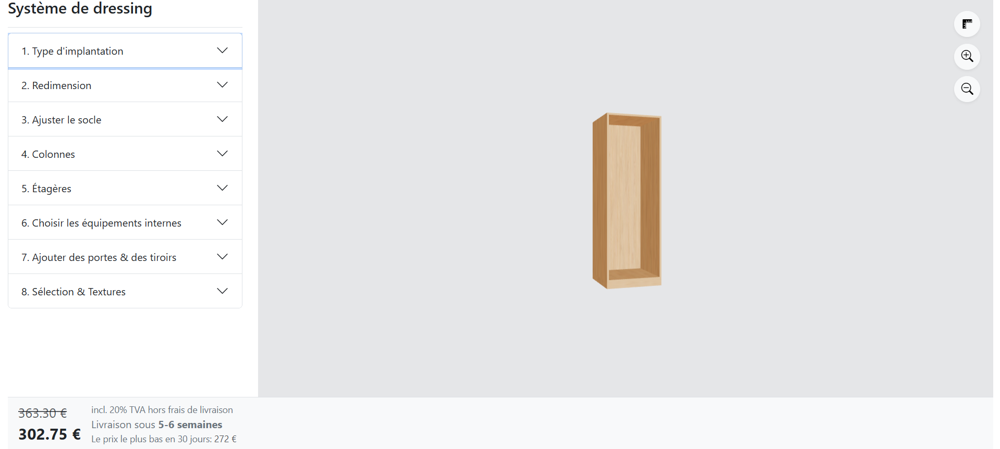

# Wardrobe-ThreeJS

A React + Three.js configurator for modular wardrobes — build and preview your custom wardrobe in real time.  
This project provides a responsive UI to configure wardrobe types, dimensions, internal equipment, shelves, textures, and preview the result in 3D with @react-three/fiber.

---

## Demo



[Live demo](https://wardrobe-threejs.vercel.app/)

## Tech Stack

- React 19 + TypeScript
- Vite for development and build
- Three.js + @react-three/fiber + @react-three/drei for 3D rendering
- Bootstrap 5 for responsive layout and UI components
- Context API for configuration state, undo/redo, and debounced updates
- ESLint + TypeScript for code quality

---

## Features

- Interactive wardrobe configuration:
  - Type, height, base bar, columns, shelves, doors/drawers, internal equipment
- Real-time 3D preview using Three.js
- Texture and LED color selection
- Undo/Redo with debounced inputs
- Responsive layout:
  - Desktop: split preview/config view
  - Mobile: stacked panels

---

## Quick Start

```bash
# Clone repository
git clone https://github.com/tuananhfr/wardrobe-threejs.git
cd wardrobe-threejs

# Install dependencies
npm install

# Run development server
npm run dev

# Build for production
npm run build
```

# Project Structure

```
src/
├── main.tsx # App bootstrap and provider wiring
├── App.tsx # Main layout (split view between config and preview)
├── context/
│ └── WardrobeContext.tsx # Config provider and undo/redo logic
├── components/
│ ├── configPanel/ # Configuration accordions and controls
│ ├── previewPanel/ # 3D preview and camera setup
│ └── bottomSection/ # Price display and action buttons
├── constants/ # Type definitions and constants
└── assets/ # Textures and static resources
```

## Key Implementation Notes

- Global configuration is managed through WardrobeConfigProvider, exposing:

- Immediate updates (updateConfig)

- Batched updates (batchUpdate)

- Debounced updates for sliders/inputs (updateConfigWithHistoryDebounced)

- Undo/Redo support with capped history (MAX_HISTORY)

- The UI uses a Bootstrap accordion system. Opening a new section resets temporary selection states to prevent accidental edits in other sections.

- The 3D renderer is divided into models, renderers, and highlight components for better modularity and maintainability.

## Development Tips

- Import aliases: @ points to src/ (set in vite.config.ts).

- Place large textures or model assets under src/assets/.

- When editing the configuration context, ensure type updates stay in sync with components using it.

## License

This project is licensed under the **MIT License**.  
Copyright © 2025 [PHAM Tuan Anh](https://github.com/tuananhfr)
